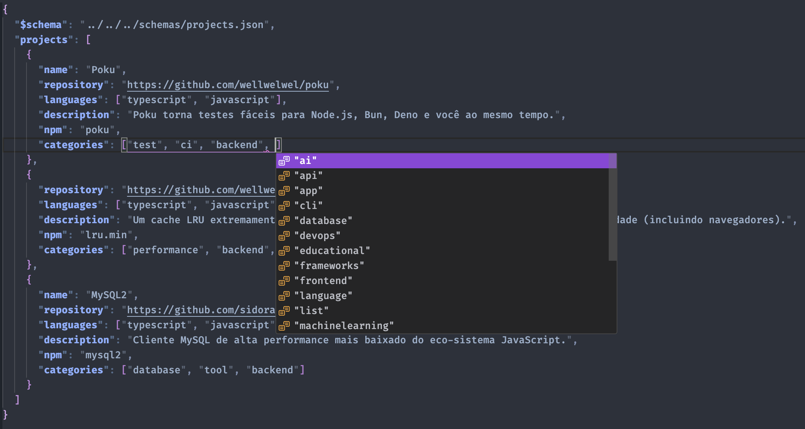

Como seu projeto impacta o mundo real?

## Cadastrando projetos de um ou mais mantenedores

### Exemplo

```json
{
  "$schema": "../../../schemas/projects.json",
  "projects": [
    {
      "name": "Meu Repositório",
      "repository": "https://github.com/meu-repositorio",
      "description": "Meu projeto impactante.",
      "support": "Vou amar ter você por aqui!",
      "madeInBrazil": true
    }
  ]
}
```

### Template

```json
{
  "$schema": "../../../schemas/projects.json",
  "projects": [
    {
      "repository": "",
      "description": "",
      "madeInBrazil": true // false
    }
  ]
}
```

```json
{
  "$schema": "../../../schemas/projects.json",
  "projects": [
    {
      "repository": "",
      "description": "",
      "name": "", // Opcional (irá usar o nome do repositório caso não for passado)
      "languages": [], // Opcional: Selecione até três linguagens de programação (veja abaixo todas as linguagens disponíveis)
      "categories": [], // Opcional: Selecione as categorias do seu projeto (veja abaixo todas as categorias disponíveis)
      "npm": "", // Opcional: nome do pacote no registro do NPM.
      "pypi": "", // Opcional: nome do pacote no registro do PyPI.
      "homebrew": "" // Opcional: nome do pacote no registro do Homebrew.
    }
  ]
}
```

### Explicando cada opção

#### `$schema`

> [!IMPORTANT]
>
> - Obrigatório.

> [!NOTE]
>
> Sempre padrão para todos os arquivos (`"../../../schemas/projects.json"`).

Essa opção garante sugestões inteligentes _(IntelliSense)_ ao inserir os dados com <kbd>Ctrl</kbd> + <kbd>Espaço</kbd> no arquivo **JSON**, por exemplo:

> 

#### `projects`

> [!IMPORTANT]
>
> - Obrigatório.
> - Ao menos um projeto é necessário para cadastrar um mantenedor.

> [!NOTE]
>
> Sempre padrão para todos os arquivos (`"projects": []`).

Recebe uma lista de projetos de um mantenedor.

##### `repository`

> [!IMPORTANT]
>
> - Obrigatório.

Insira a **URL** do seu repositório no **GitHub**, por exemplo: `https://github.com/wellwelwel/poku`.

##### `description`

> [!IMPORTANT]
>
> - Obrigatório.
> - Limite de 200 caracteres.

Faça uma breve descrição do seu projeto (em português ou inglês — como você preferir).
